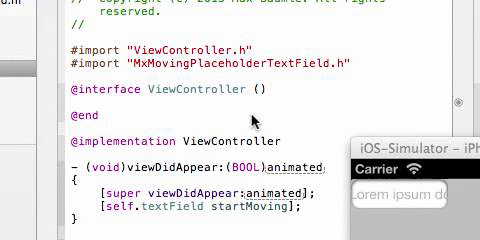
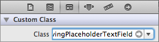

MovingPlaceholderTextField
==========================

A `UITextField` subclass animating the placeholder text if it extends the bounds of the text field. It supports texts of any length, font and size (even custom fonts!). Speed defaults to 30 FPS.

Installation
------------

Just drag the class files into your project and make sure to `#import "MxMovingPlaceholderTextField.h"`.

Usage
-----

Either drop a `UITextField` control into your view in Interface Builder and change the class to `MxMovingPlaceholderTextField` in the inspector tab or insert a few lines of code:

    MxMovingPlaceholderTextField *textField = [[MxMovingPlaceholderTextField alloc] initWithFrame:CGRectMake(0.0f, 0.0f, 97.0f, 30.0f)];
    textField.placeholder = @"Lorem ipsum dolor sit amet...";
    [self.view addSubview:textField];
    [textField startMoving];

Apart from that you can also stop the animation:

    [textField stopMoving];

Requirements
------------

`MxMovingPlaceholderTextField` uses ARC and targets iOS 4.0+.

License
-------

> Copyright (c) 2013 Max Bäumle. All rights reserved.
>
> Permission is hereby granted, free of charge, to any person obtaining a copy of this
> software and associated documentation files (the "Software"), to deal in the Software
> without restriction, including without limitation the rights to use, copy, modify,
> merge, publish, distribute, sublicense, and/or sell copies of the Software, and to
> permit persons to whom the Software is furnished to do so, subject to the following
> conditions:
>
> The above copyright notice and this permission notice shall be included in all copies or 
> substantial portions of the Software.
>
> THE SOFTWARE IS PROVIDED "AS IS", WITHOUT WARRANTY OF ANY KIND, EXPRESS OR IMPLIED,
> INCLUDING BUT NOT LIMITED TO THE WARRANTIES OF MERCHANTABILITY, FITNESS FOR A PARTICULAR 
> PURPOSE AND NONINFRINGEMENT. IN NO EVENT SHALL THE AUTHORS OR COPYRIGHT HOLDERS BE
> LIABLE FOR ANY CLAIM, DAMAGES OR OTHER LIABILITY, WHETHER IN AN ACTION OF CONTRACT, TORT
> OR OTHERWISE, ARISING FROM, OUT OF OR IN CONNECTION WITH THE SOFTWARE OR THE USE OR
> OTHER DEALINGS IN THE SOFTWARE.
